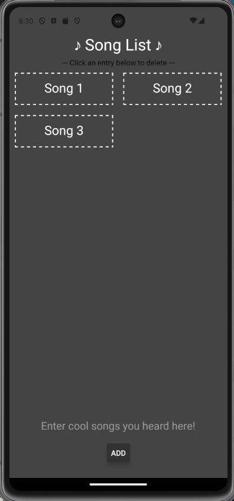
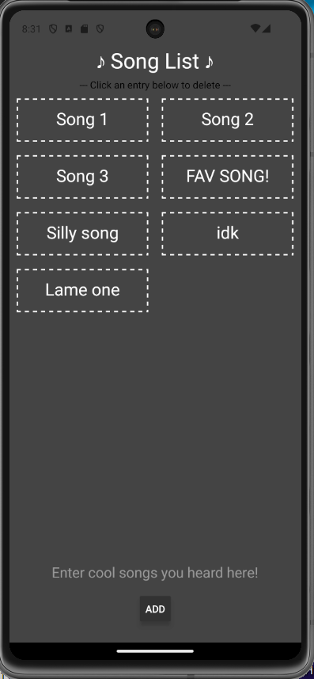
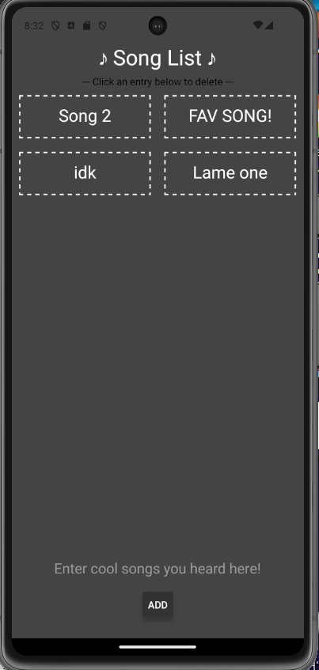

# INFO 670 Assignment 2 - Grocery List (w/ Delete Functionality)

## Design and Purpose

This app is designed to allow you to log your favorite songs!  
It is intended for musicians, but can really log anything you want...

## Basic Use

Using the app is simple:

1. Open the app.
2. To add a song, simply type in the name and click the button below (no  blank entries allowed).
3. You can then delete items simply by tapping the item you do not want! Bye Bye!

## Screenshots

Below are three screenshots that showcase the app's interface and core features required for the assignment:

### Screenshot 1: Home Screen

### Screenshot 2: Adding an Item

### Screenshot 3: Deleting an Item
