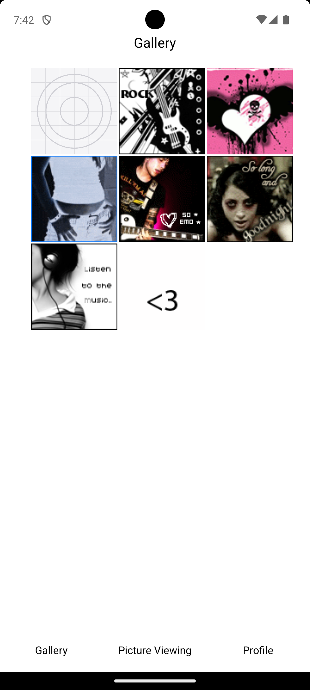
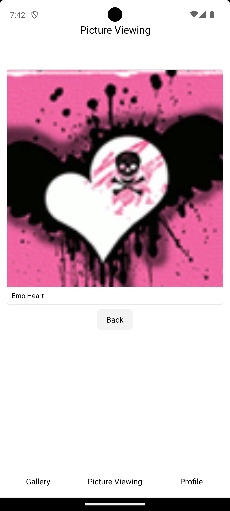
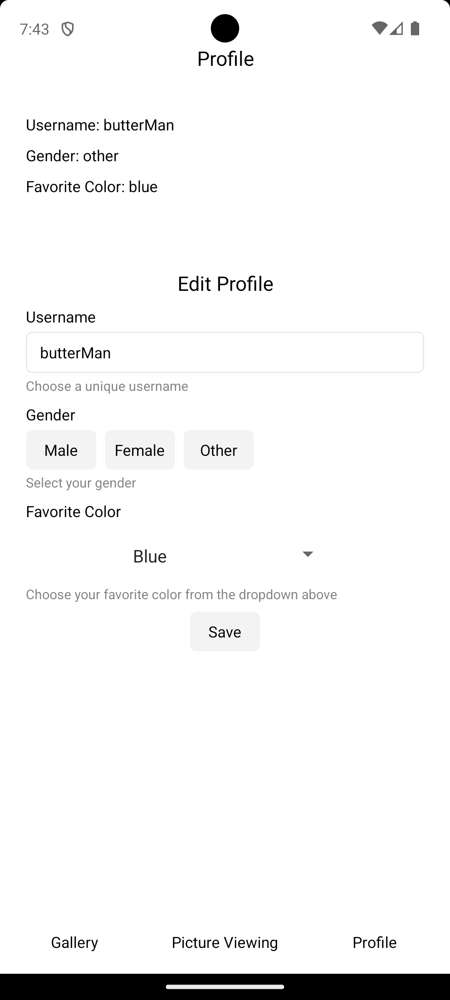

# INFO 670 Assignment 3 - Gallery & Viewing (w/ Account Customization)

## Design and Purpose

This app is designed to allow you to view images and their captions!  
It is intended for photographers or anyone interested in images...

## Basic Use

Using the app is simple:

1. Open the app.
2. Click an image.
3. View the image and the caption!!
4. (Optional) Click the account button to customize your account details <3

## Screenshots

Below are three screenshots that showcase the app's interface and core features required for the assignment:

### Screenshot 1: Gallery

### Screenshot 2: Picture Viewing

### Screenshot 3: Profile
