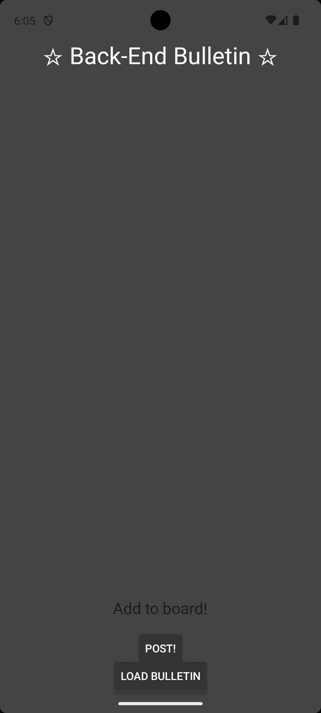
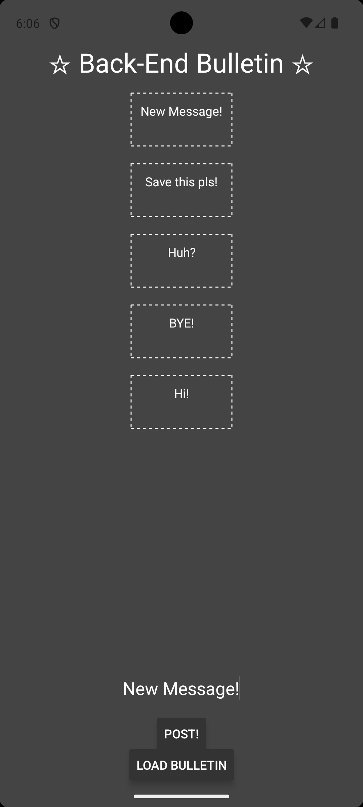
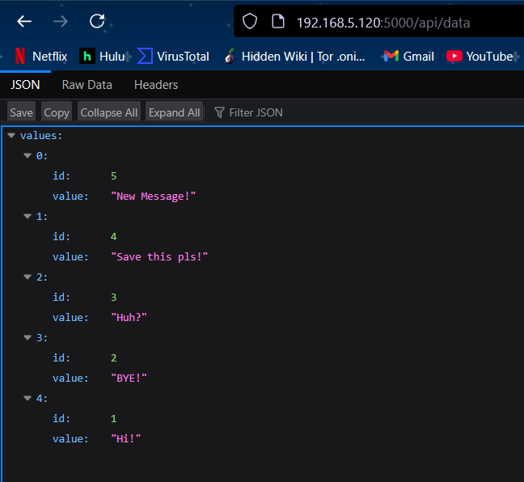

# INFO 670 Assignment 4 - Back-End Bulletin Board (w/ Node.js + Express & SQLite)

## Design and Instructions

This app is designed to allow people in a team to share ideas in a bulletin board!
Make sure you clone this repository and download all dependecies with npm! In order for the database to work on mobile devices, you may have to set the API_URL to your devices IP Address instead! Make sure you run the server.js file in node in a separate terminal.

## Basic Use

Using the app is simple:

1. Open the app.
2. Type a note and click post.
3. View the note posted to the board. The Notes persist in the database!

## Front-End Design Explanation & Screenshots

Below are screenshots that showcase the app's interface and core features required for the assignment. The Front-End was designed in React Native and contains two functions that connect to the Back-End: Post & Load.
1. Post - This function queries /api/save with the value in the textbox to send to the database.
2. Load - This function queries /api/data, which returns an array of all the values in the database.

### Screenshot 1: Base UI

### Screenshot 2: Bulletin with Posted Notes

## Back-End Design

For the Back-End design, I decided to go with Node.js + Express for the simplicity and ease of connectivity to React Native. In server.js, I created an express object and used a body parser package to manage the JSON data. In the file there are two API endpoints which connect with the database: Save & Load.
1. Save - This API endpoint stores the data it is sent as a new entry in the Strings array in the database.
2. Data - This API endpoint, when queried, displays all of the data in the Strings array.
The Server uses SQLite statements to connect to the data.db file and manage the information stored within it.

### Screenshot 3: API Call
